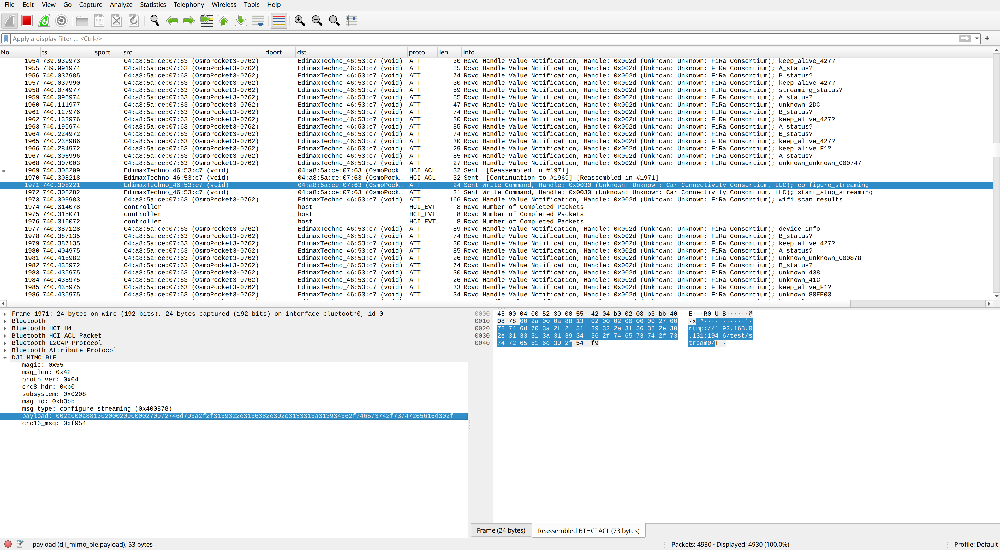

Here we have some of the reverse-engineering artifacts I produced during implementation of [`djictl`](https://github.com/xaionaro-go/djictl). `djictl` is an opensource CLI tool that replaces proprietary DJI MIMO to unlock access to remote control of DJI Osmo devices.

To get BLE logs from an Android phone use:
```sh
adb bugreport bt-logs
```

and `adb pull` to get the resulting report. Inside the archive look for file `FS/data/misc/bluetooth/logs/btsnoop_hci.log`.

Then install the Wireshark plugin from [`./mimo/ble/wireshark-dissector/`](./mimo/ble/wireshark-dissector/), and use Wireshark to open the file. You'll get something like this:


I've managed to make livestreaming work on my DJI Osmo Pocket 3. And I guess for now I'm pausing any further reverse engineering, since that was the feature that I needed.

But I'm happy to answer any questions if you are having problems to continue the research.
